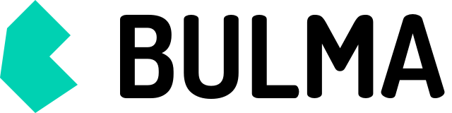
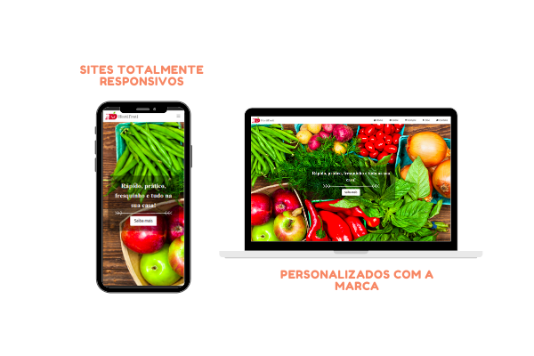

### Olá, mundoooo!👋

Uma mente criando um website é bacana, mas duas mentes é espetacular ,né verdade?😜

A FreelaTwins👩🏻‍💻👩🏻‍💻 foi criada com o objetivo de unir conhecimento e forças para desenvolver as melhores plataformas web para a sua empresa.

A nossa especialidade gira em torno da construção de sites estáticos e modernos baseada no uso de frameworks avançados como o Next.js e o Bulma.

 

<i>Nossos diferenciais:<i>
- Prototipagem inicial feita no canvas e extremamente detalhada para a validação do cliente.
- Utilização do que há de melhor em UX (experiência do usuário);
- Melhor ranquemento em motores de busca e mais acessibilidade - SEO ;
- Desenvolvimento em react.js , html , css e javascript;
- Hospedagem simples e rápida pela plataforma Vercel.

💻 Agilidade em processamento - Responsividade - Design Moderno e Personalizado - Conexão automática e dinâmica com o whatsapp 💻

Nosso comprometimento maior é disponibilizar a ferramenta mais moderna possível que proporcione o aumento da geração de leads para a sua empresa.🤝

